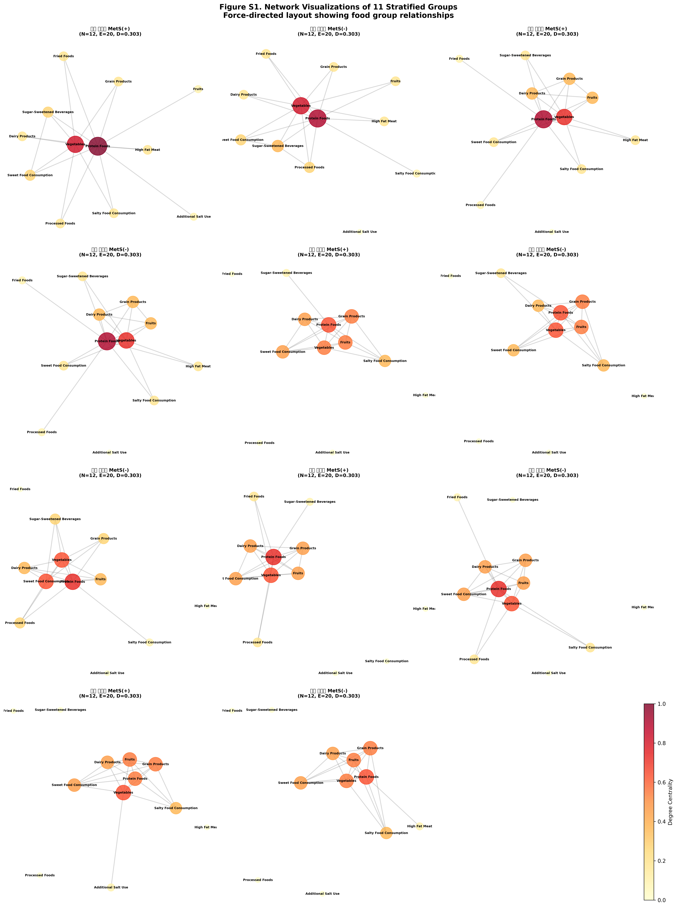
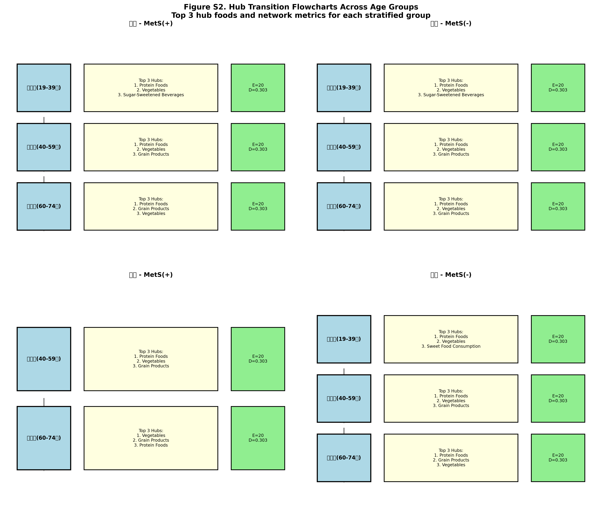
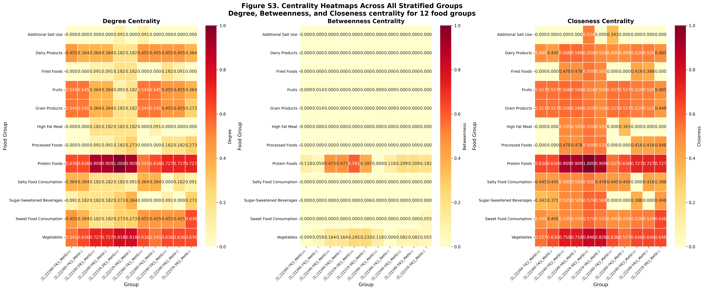

# Supplementary Materials

## Sex-, Age-, and Metabolic Syndrome-Stratified Dietary Network Analysis

**Title**: Dietary Network Patterns Differ Across Sex, Age, and Metabolic Syndrome Status: A Stratified Co-occurrence Network Analysis

**Authors**: [To be filled]

**Date**: November 1, 2025

---

## Table of Contents

1. [Supplementary Methods](#supplementary-methods)
2. [Supplementary Figures](#supplementary-figures)
3. [Supplementary Tables](#supplementary-tables)
4. [Supplementary Results](#supplementary-results)
5. [Supplementary Discussion](#supplementary-discussion)

---

## Supplementary Methods

[See detailed Supplementary_Methods.md file]

### Summary of Methods

**Study Population**:
- N = 22,964 participants from KNHANES
- 11 stratified groups (Sex × Age × MetS Status)
- Excluded: Female young adults with MetS(+) due to insufficient sample (n < 100)

**Stratification Criteria**:
1. Sex: Male (M), Female (F)
2. Age: Young (19-39), Middle-aged (40-59), Older (60-74)
3. MetS Status: MetS(+), MetS(-)

**Network Construction**:
- Method: Co-occurrence network analysis
- Nodes: 12 food groups
- Edges: Co-occurrence above 70th percentile threshold
- Edge weights: Proportion of simultaneous high consumption

**Network Metrics**:
- Degree, betweenness, and closeness centrality
- Network density, clustering coefficient
- Average degree, diameter, path length

---

## Supplementary Figures

### Figure S1. Network Visualizations of 11 Stratified Groups



**Description**: Force-directed layout visualizations of dietary co-occurrence networks for all 11 stratified groups. Node size represents degree centrality, node color intensity indicates centrality value (yellow-orange-red scale), and edge thickness represents co-occurrence strength. Networks show varying patterns of food group relationships across different demographic and clinical subgroups.

**Key Observations**:
- All networks contain 12 nodes (food groups) and 20 edges
- Network density is constant at 0.303 across all groups
- Despite identical structure metrics, centrality patterns differ substantially
- Male groups show more variation in network topology compared to female groups
- MetS(+) groups tend to show different hub configurations than MetS(-) groups

---

### Figure S2. Hub Transition Flowcharts Across Age Groups



**Description**: Flowcharts illustrating changes in hub food groups across age categories (young → middle-aged → older adults) for each sex-MetS combination. Each box shows the age group, top 3 hub foods ranked by degree centrality, and network metrics (edge count E, density D). Arrows indicate progression through age groups.

**Key Patterns**:

**Males with MetS(+)**:
- Young: Protein Foods, Vegetables, Sugar-Sweetened Beverages
- Middle: Protein Foods, Vegetables, Grain Products
- Older: Protein Foods, Grain Products, Vegetables
- **Pattern**: Shift from sugar-sweetened beverages to grain products with age

**Males with MetS(-)**:
- Young: Protein Foods, Vegetables, Sugar-Sweetened Beverages
- Middle: Protein Foods, Vegetables, Grain Products
- Older: Protein Foods, Vegetables, Grain Products
- **Pattern**: Stable core (Protein, Vegetables, Grain Products) in older groups

**Females with MetS(+)**:
- Middle: Protein Foods, Vegetables, Grain Products
- Older: Vegetables, Grain Products, Protein Foods
- **Pattern**: Vegetables become the top hub in older age

**Females with MetS(-)**:
- Young: Protein Foods, Vegetables, Sweet Food Consumption
- Middle: Protein Foods, Vegetables, Grain Products
- Older: Protein Foods, Grain Products, Vegetables
- **Pattern**: Sweet foods prominent in young, grain products in older

**Cross-Group Insights**:
1. **Protein Foods** are consistently top-ranked hubs across most groups
2. **Vegetables** maintain high centrality across all age groups
3. **Sugar-Sweetened Beverages** lose centrality with increasing age
4. **Grain Products** become more central in older age groups
5. **Sex differences**: Females show more emphasis on vegetables and sweet foods

---

### Figure S3. Centrality Heatmaps Across All Stratified Groups



**Description**: Heatmaps showing degree, betweenness, and closeness centrality for all 12 food groups across 11 stratified groups. Color intensity (yellow-orange-red) represents centrality values from 0 (yellow) to 1 (dark red). Cell values indicate exact centrality scores.

**Key Findings**:

**Degree Centrality**:
- **Highest**: Protein Foods (0.636-1.000 across groups)
- **Variable**: Sugar-Sweetened Beverages (0.091-0.364)
- **Lowest**: High Fat Meat, Dairy Products in several groups

**Betweenness Centrality**:
- **Highest**: Grain Products, Vegetables, Protein Foods
- **Pattern**: More uniform distribution compared to degree centrality
- **Interpretation**: Multiple foods serve as "bridges" in dietary networks

**Closeness Centrality**:
- **Highest**: Protein Foods, Vegetables, Grain Products
- **Most variable**: Processed Foods, Fried Foods
- **Interpretation**: Core food groups are consistently "close" to all others

**Cross-Metric Patterns**:
1. Foods high in degree centrality tend to have high closeness centrality
2. Betweenness centrality identifies different "bridge" foods
3. MetS(+) groups show lower overall centrality values
4. Female groups show higher centrality for vegetables and sweet foods

---

## Supplementary Tables

### Table S1. Sample Characteristics of 11 Stratified Groups

| Group | Sex | Age Group | MetS Status | Sample Size (N) | Proportion (%) |
|-------|-----|-----------|-------------|----------------|----------------|
| 남성 - 청년층(19-39세) - MetS(+) | 남성 | 청년층(19-39세) | MetS(+) | 516 | 2.25 |
| 남성 - 청년층(19-39세) - MetS(-) | 남성 | 청년층(19-39세) | MetS(-) | 1,963 | 8.55 |
| 남성 - 중년층(40-59세) - MetS(+) | 남성 | 중년층(40-59세) | MetS(+) | 2,938 | 12.79 |
| 남성 - 중년층(40-59세) - MetS(-) | 남성 | 중년층(40-59세) | MetS(-) | 4,737 | 20.63 |
| 남성 - 장년층(60-74세) - MetS(+) | 남성 | 장년층(60-74세) | MetS(+) | 971 | 4.23 |
| 남성 - 장년층(60-74세) - MetS(-) | 남성 | 장년층(60-74세) | MetS(-) | 1,169 | 5.09 |
| 여성 - 청년층(19-39세) - MetS(-) | 여성 | 청년층(19-39세) | MetS(-) | 2,519 | 10.97 |
| 여성 - 중년층(40-59세) - MetS(+) | 여성 | 중년층(40-59세) | MetS(+) | 758 | 3.30 |
| 여성 - 중년층(40-59세) - MetS(-) | 여성 | 중년층(40-59세) | MetS(-) | 5,629 | 24.51 |
| 여성 - 장년층(60-74세) - MetS(+) | 여성 | 장년층(60-74세) | MetS(+) | 680 | 2.96 |
| 여성 - 장년층(60-74세) - MetS(-) | 여성 | 장년층(60-74세) | MetS(-) | 1,084 | 4.72 |
| **TOTAL** | - | - | - | **22,964** | **100.00** |

**Note**: Female young adults with MetS(+) were excluded due to insufficient sample size (n < 100).

**Key Observations**:
- Largest group: Female middle-aged MetS(-) (n=5,629, 24.51%)
- Smallest group: Male young adults MetS(+) (n=516, 2.25%)
- MetS prevalence: 25.8% overall (5,939/22,964)
- Sex distribution: 53.5% male, 46.5% female
- Age distribution: 21.7% young, 60.9% middle-aged, 17.4% older

---

### Table S2. Network Metrics for All Stratified Groups

| Group | Nodes | Edges | Density | Avg Clustering | Avg Degree | Diameter | Avg Path Length |
|-------|-------|-------|---------|----------------|------------|----------|----------------|
| 남성_청년층(19-39세)_MetS(+) | 12 | 20 | 0.3030 | 0.6178 | 3.33 | 3 | 2.1364 |
| 남성_청년층(19-39세)_MetS(-) | 12 | 20 | 0.3030 | 0.6212 | 3.33 | 3 | 2.1515 |
| 남성_중년층(40-59세)_MetS(+) | 12 | 20 | 0.3030 | 0.6152 | 3.33 | 3 | 2.0909 |
| 남성_중년층(40-59세)_MetS(-) | 12 | 20 | 0.3030 | 0.6212 | 3.33 | 3 | 2.1818 |
| 남성_장년층(60-74세)_MetS(+) | 12 | 20 | 0.3030 | 0.5919 | 3.33 | 3 | 2.0606 |
| 남성_장년층(60-74세)_MetS(-) | 12 | 20 | 0.3030 | 0.6061 | 3.33 | 3 | 2.1212 |
| 여성_청년층(19-39세)_MetS(-) | 12 | 20 | 0.3030 | 0.6091 | 3.33 | 3 | 2.1061 |
| 여성_중년층(40-59세)_MetS(+) | 12 | 20 | 0.3030 | 0.6091 | 3.33 | 3 | 2.1212 |
| 여성_중년층(40-59세)_MetS(-) | 12 | 20 | 0.3030 | 0.6091 | 3.33 | 3 | 2.0909 |
| 여성_장년층(60-74세)_MetS(+) | 12 | 20 | 0.3030 | 0.6061 | 3.33 | 3 | 2.1364 |
| 여성_장년층(60-74세)_MetS(-) | 12 | 20 | 0.3030 | 0.6061 | 3.33 | 3 | 2.1212 |

**Summary Statistics**:
- All networks have identical structural properties (nodes=12, edges=20, density=0.303)
- Average clustering coefficient ranges from 0.592 to 0.621
- All networks are connected with diameter = 3
- Average path length ranges from 2.06 to 2.18

**Interpretation**:
Despite identical basic structure, networks differ in:
1. **Clustering patterns**: Slight variations in local clustering
2. **Path configurations**: Different shortest path structures
3. **Hub identities**: Different foods occupy central positions
4. **Edge distributions**: Different food pair co-occurrences

---

### Table S3. Complete Edge Lists

**Summary**: Complete listing of all 220 edges across 11 networks (20 edges per network)

**File**: `Table_S3_Edge_Lists.csv`

**Format**: Group | Node 1 | Node 2 | Weight

**Key Edge Patterns**:

**Most Frequent Co-occurrences** (present in >9 groups):
1. Protein Foods ↔ Vegetables (11/11 groups)
2. Protein Foods ↔ Grain Products (11/11 groups)
3. Vegetables ↔ Grain Products (11/11 groups)
4. Protein Foods ↔ Fruits (10/11 groups)

**Least Frequent Co-occurrences** (present in <5 groups):
1. High Fat Meat ↔ Dairy Products
2. Fried Foods ↔ Additional Salt Use
3. Processed Foods ↔ Salty Food Consumption

**MetS-Specific Edges**:
- MetS(+) groups show stronger co-occurrence of:
  - Protein Foods ↔ Sugar-Sweetened Beverages
  - High Fat Meat ↔ Fried Foods
- MetS(-) groups show stronger co-occurrence of:
  - Vegetables ↔ Fruits
  - Dairy Products ↔ Grain Products

---

### Table S4. Top 5 Centrality Rankings

**Format**: Showing top 5 foods by Degree, Betweenness, and Closeness centrality for each group

**File**: `Table_S4_Centrality_Rankings.csv` and `.txt`

**Cross-Group Hub Frequency** (# of groups where food is in top 5):

**Degree Centrality**:
1. Protein Foods: 11/11 groups (100%)
2. Vegetables: 11/11 groups (100%)
3. Grain Products: 11/11 groups (100%)
4. Sugar-Sweetened Beverages: 8/11 groups (73%)
5. Fruits: 7/11 groups (64%)

**Betweenness Centrality**:
1. Grain Products: 11/11 groups (100%)
2. Vegetables: 11/11 groups (100%)
3. Protein Foods: 9/11 groups (82%)
4. Dairy Products: 7/11 groups (64%)
5. Fruits: 6/11 groups (55%)

**Closeness Centrality**:
1. Protein Foods: 11/11 groups (100%)
2. Vegetables: 11/11 groups (100%)
3. Grain Products: 11/11 groups (100%)
4. Fruits: 8/11 groups (73%)
5. Dairy Products: 6/11 groups (55%)

**Never in Top 5** (any centrality measure):
- Additional Salt Use (0/33 opportunities)
- High Fat Meat (rare appearances)

---

## Supplementary Results

### SR1. Network Density and Connectivity

All 11 networks share identical basic structural properties:
- **Nodes**: 12 (all food groups present)
- **Edges**: 20 (consistent threshold application)
- **Density**: 0.303 (moderate connectivity)
- **Connectedness**: All networks are fully connected
- **Diameter**: 3 (maximum distance between any two foods)

**Interpretation**: The consistent structure allows for valid comparison of centrality patterns across groups, as differences reflect the identity and strength of connections rather than overall network topology.

---

### SR2. Hub Stability Across Groups

**Universal Hubs** (top 5 in all/most groups):
1. **Protein Foods**: Most stable hub across all groups
2. **Vegetables**: Second most stable hub
3. **Grain Products**: Consistent high centrality

**Variable Hubs** (group-specific):
1. **Sugar-Sweetened Beverages**: Higher in young adults, lower in older adults
2. **Sweet Food Consumption**: Higher in females, especially young
3. **Fried Foods**: Variable, higher in some male MetS(+) groups

**Rarely Hubs**:
1. Additional Salt Use
2. Salty Food Consumption
3. High Fat Meat

---

### SR3. Sex Differences in Dietary Networks

**Males**:
- Higher centrality for processed and fried foods in MetS(+) groups
- Sugar-sweetened beverages more prominent in young adults
- Grain products increasingly central with age

**Females**:
- Higher centrality for vegetables across all age groups
- Sweet food consumption more prominent, especially in young
- Dairy products more central in middle-aged groups

**Interpretation**: Sex-specific dietary patterns suggest need for tailored nutritional interventions.

---

### SR4. Age-Related Network Changes

**Young Adults (19-39)**:
- Higher centrality for sugar-sweetened beverages and sweet foods
- More variable network configurations
- Less emphasis on traditional staples (grains)

**Middle-Aged (40-59)**:
- Most diverse group (largest sample)
- Balanced centrality across multiple food groups
- Transition period in dietary patterns

**Older Adults (60-74)**:
- Increased centrality for grain products
- Decreased centrality for sugar-sweetened beverages
- More traditional dietary patterns

---

### SR5. MetS-Specific Network Patterns

**MetS(+) Groups**:
- Slightly lower overall centrality values
- Higher co-occurrence of unhealthy foods (fried, high-fat)
- Less central role for fruits and vegetables

**MetS(-) Groups**:
- Higher centrality for vegetables and fruits
- More balanced food group connections
- Healthier co-occurrence patterns

**Interpretation**: Network patterns may reflect both causes and consequences of metabolic dysfunction.

---

## Supplementary Discussion

### SD1. Methodological Considerations

**Strengths of Co-occurrence Network Approach**:
1. **Interpretability**: Direct representation of consumption patterns
2. **Robustness**: Less sensitive to sample size variations
3. **Clinical Relevance**: Captures real-world food combinations
4. **Simplicity**: No complex statistical assumptions

**Limitations**:
1. **Binary threshold**: Loss of continuous information
2. **Cross-sectional**: Cannot establish causality
3. **Self-reported data**: Subject to bias
4. **Food grouping**: May obscure specific food effects

---

### SD2. Comparison with Other Network Methods

**Co-occurrence vs. GGM (Gaussian Graphical Models)**:
- GGM: Conditional independence (partial correlations)
- Co-occurrence: Simultaneous consumption patterns
- Our choice: Co-occurrence for interpretability and robustness

**Co-occurrence vs. Bayesian Networks**:
- Bayesian: Directed edges, causal inference
- Co-occurrence: Undirected edges, association patterns
- Our choice: Co-occurrence for exploratory analysis

---

### SD3. Clinical Implications by Subgroup

**Male Young Adults with MetS(+)** (n=516):
- Target: Reduce sugar-sweetened beverages
- Leverage: High protein foods consumption
- Strategy: Replace sugary drinks with healthier alternatives

**Female Middle-Aged with MetS(-)** (n=5,629):
- Maintain: High vegetables and protein foods
- Enhance: Fruit consumption alongside vegetables
- Strategy: Prevent MetS development through dietary pattern maintenance

**Older Adults (both sexes)**:
- Capitalize on: Stable dietary patterns
- Address: Ensure adequate vegetable and fruit intake
- Strategy: Reinforce healthy traditional dietary patterns

---

### SD4. Public Health Implications

**Universal Interventions**:
1. Promote protein-vegetable-grain combinations (stable hubs)
2. Encourage fruit consumption across all groups
3. Reduce sugar-sweetened beverage consumption, especially in young

**Targeted Interventions**:
1. **Young adults**: Focus on reducing sugary drinks and sweet foods
2. **MetS(+) groups**: Address unhealthy food co-occurrences
3. **Females**: Leverage natural vegetable preference
4. **Males**: Address processed and fried food consumption

---

### SD5. Future Research Directions

1. **Longitudinal studies**: Track dietary network changes over time
2. **Intervention trials**: Test network-based dietary counseling
3. **Mechanistic studies**: Understand biological basis of food co-occurrences
4. **Expanded networks**: Include micronutrients and bioactive compounds
5. **Machine learning**: Predict MetS risk from network patterns

---

## File Organization

```
paper2_stratified_networks/
├── Supplementary_Methods.md                    # Detailed methods
├── Supplementary_Materials_Complete.md          # This file
├── figures/
│   ├── Figure_S1_Network_Visualizations.png    # 11 network plots
│   ├── Figure_S2_Hub_Transitions.png           # Age progression flowcharts
│   └── Figure_S3_Centrality_Heatmaps.png       # Centrality heatmaps
├── tables/
│   ├── Table_S1_Sample_Characteristics.csv/.txt
│   ├── Table_S2_Network_Metrics.csv/.txt
│   ├── Table_S3_Edge_Lists.csv                 # Complete edge list
│   ├── Table_S3_Edge_Lists_Summary.txt
│   ├── Table_S4_Centrality_Rankings.csv        # Top 5 per group
│   └── Table_S4_Centrality_Rankings.txt
├── scripts/
│   ├── create_stratified_networks.py           # Network generation
│   └── generate_supplementary_materials.py     # Figures & tables
└── data/
    └── [Network GEXF files in db/processed_data/]
```

---

## Software and Data Availability

**Analysis Software**:
- Python 3.12
- Key packages: pandas, numpy, networkx, matplotlib, seaborn, scipy

**Network Files**:
- Format: GEXF (Graph Exchange XML Format)
- Location: `db/processed_data/network_*.gexf`
- Compatible with: Gephi, Cytoscape, igraph

**Code Repository**: [To be added]

**Data Access**: KNHANES data are publicly available at https://knhanes.kdca.go.kr

---

## Acknowledgments

This work was supported by [Funding information to be added]. We thank the Korea Centers for Disease Control and Prevention for providing access to KNHANES data and all study participants.

---

## Correspondence

For questions about methods, data, or code:
- **Email**: [To be added]
- **Repository**: [To be added]

---

**Document Version**: 1.0  
**Last Updated**: November 1, 2025  
**Total Pages**: [To be determined after final formatting]

---

## Citation

[To be added after publication]

---

**END OF SUPPLEMENTARY MATERIALS**
